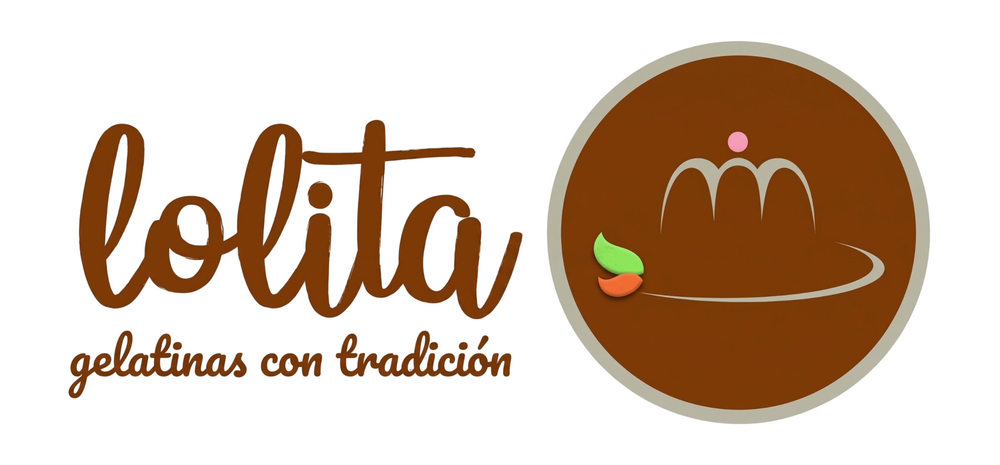

# 🍮 Gelatinas Lolita

<p align="center">
  
</p>

<p align="center">
  <strong>Tradición artesanal desde 1974 — Huajuapan de León, Oaxaca</strong>
</p>

<p align="center">
  <a href="https://astro.build"></a>
  <a href="https://tailwindcss.com"></a>
  <a href="https://www.typescriptlang.org"></a>
  <a href="https://workers.cloudflare.com"></a>
  
  
</p>

---

## 📋 Descripción

Sitio web oficial de **Gelatinas Lolita**, una dulcería artesanal familiar fundada en 1974 en Huajuapan de León, Oaxaca. El sitio funciona como escaparate digital del negocio, mostrando su menú completo de postres tradicionales mexicanos — gelatinas, flanes, carlotas, cremitas y pay de queso —, información de contacto y ubicación, y un formulario para solicitar cotizaciones de eventos.

---

## ✨ Características

- 🏠 **Página principal** con hero section, productos destacados, identidad local y sección de eventos
- 📋 **Menú completo** con 9 productos en 5 categorías, filtros por tipo y diseños de tarjeta adaptativos
- 📍 **Página de visita** con mapa interactivo de Google Maps, datos de contacto y galería del espacio
- 📱 **Diseño responsive** con Tailwind CSS v4
- 🎨 **Sistema de diseño** basado en Material Design 3 con paleta personalizada
- 🚀 **Renderizado SSR** desplegado en Cloudflare Workers
- 🔄 **View Transitions** para navegación fluida entre páginas

---

## 🛠️ Stack Tecnológico

| Tecnología | Versión | Propósito |
|---|---|---|
| [](https://astro.build) | 7.0 | Framework web — generación de sitios estáticos y SSR |
| [](https://tailwindcss.com) | 4.0 | Framework de estilos utilitario |
| [](https://www.typescriptlang.org) | 6.0 | Superconjunto tipado de JavaScript |
| [](https://workers.cloudflare.com) | — | Plataforma de edge computing para SSR |
| [](https://fonts.google.com) | — | Tipografía: Libre Caslon Text + Hanken Grotesk |
| [](https://fonts.google.com/icons) | — | Iconografía |

---

## 📁 Estructura del Proyecto

```
gelatinas-lolita/
├── public/                          # Archivos estáticos
│   ├── favicon.svg / favicon.ico    # Favicon del sitio
│   ├── LogoGelatinasLolita.png      # Logotipo oficial
│   ├── catedral.png                 # Hero — Catedral de Huajuapan
│   ├── CremitaEncabezado.png        # Hero — producto destacado
│   ├── Cremita.png                  # Producto: Cremita Histórica
│   ├── mosaico.png                  # Producto: Gelatina Mosaico
│   ├── gelatina-jerez.png           # Producto: Gelatina de Jerez
│   ├── gelatina-limon.png           # Producto: Gelatina de Limón
│   ├── flan-horneado.png            # Producto: Flan Horneado
│   ├── flan-sencillo.png            # Producto: Flan Sencillo
│   ├── carlota-limon.png            # Producto: Carlota de Limón
│   ├── carlota-cafe.png             # Producto: Carlota de Café
│   ├── Pay.png                      # Producto: Pay de Queso
│   └── comercio.png                 # Interior del establecimiento
│
├── src/
│   ├── layouts/
│   │   └── Layout.astro             # Layout principal (HTML shell, fuentes, estilos globales)
│   ├── pages/
│   │   ├── index.astro              # Página principal  →  /
│   │   ├── menu.astro               # Menú completo     →  /menu
│   │   └── visitanos.astro          # Visita y contacto  →  /visitanos
│   ├── components/
│   │   ├── Header.astro             # Barra de navegación fija con CTA
│   │   ├── HeroSection.astro        # Hero con imagen de fondo y badge "DESDE 1974"
│   │   ├── ProductGrid.astro        # Cuadrícula de 3 productos destacados
│   │   ├── ProductCard.astro        # Tarjeta individual de producto
│   │   ├── IdentitySection.astro    # Sección "Identidad Local"
│   │   ├── EventsSection.astro      # Sección "Eventos y Celebraciones"
│   │   ├── Footer.astro             # Pie de página principal
│   │   ├── HeroVisitanos.astro      # Hero de la página /visitanos
│   │   ├── LocationGrid.astro       # Mapa + datos de contacto
│   │   ├── NuestroEspacio.astro     # Galería del local y amenidades
│   │   ├── CTAEventosVisitanos.astro  # Botones de llamado a la acción
│   │   ├── FooterVisitanos.astro    # Pie de página variante para /visitanos
│   │   └── menu/                    # Componentes del menú
│   │       ├── MenuHeader.astro
│   │       ├── MenuFilterPills.astro    # Filtros por categoría
│   │       ├── MenuSectionGelatinas.astro
│   │       ├── MenuSectionFlanes.astro
│   │       ├── MenuSectionCarlotas.astro
│   │       ├── MenuSectionCremitas.astro
│   │       ├── MenuSectionPay.astro
│   │       ├── MenuCardVertical.astro
│   │       ├── MenuCardHorizontal.astro
│   │       ├── MenuCardFeatured.astro
│   │       ├── MenuSidebarPedido.astro
│   │       ├── MenuSidebarPay.astro
│   │       └── MenuCulturalMotif.astro
│   ├── data/
│   │   └── menu.ts                  # Datos tipados del menú (9 productos, 5 categorías)
│   └── styles/
│       └── global.css               # Tailwind v4 @import + @theme personalizado
│
├── astro.config.mjs                 # Configuración de Astro (SSR + Cloudflare + Tailwind)
├── tsconfig.json                     # Configuración de TypeScript
├── wrangler.jsonc                    # Configuración de despliegue Cloudflare Workers
├── package.json
└── design.md                         # Documentación del sistema de diseño
```

---

## 🚀 Comandos

Todos los comandos se ejecutan desde la raíz del proyecto:

| Comando | Acción |
|---|---|
| `npm install` | Instala las dependencias |
| `npm run dev` | Inicia el servidor de desarrollo en `localhost:4321` |
| `npm run build` | Compila el sitio de producción en `./dist/` |
| `npm run preview` | Previsualiza la compilación localmente |
| `npm run astro check` | Ejecuta verificación de tipos |
| `npm run astro -- --help` | Ayuda de la CLI de Astro |

### Desarrollo en segundo plano

```bash
npm run dev &
astro dev logs      # Ver logs del servidor
astro dev stop      # Detener servidor
astro dev status    # Estado del servidor
```

---

## 🌐 Despliegue

El sitio está configurado para desplegarse en **Cloudflare Workers** mediante el adaptador `@astrojs/cloudflare`:

1. El build genera los directorios `dist/client/` (estáticos) y `dist/server/` (función SSR)
2. El archivo `wrangler.jsonc` define la configuración del Worker, incluyendo un binding de KV namespace (`SESSION`)
3. Para desplegar manualmente:

```bash
npm run build
npx wrangler deploy
```

---

## 🎨 Sistema de Diseño

El proyecto incluye un sistema de diseño detallado en [`design.md`](design.md) con:

- **Paleta de colores** basada en Material Design 3 (primary, secondary, tertiary, surfaces, outlines, error)
- **Tipografía**: Libre Caslon Text (display) + Hanken Grotesk (cuerpo)
- **Escala de espaciado**: unidad base de 8px, gutter de 24px, contenedor máximo de 1200px
- **Tokens de border radius**: 2px, 4px, 8px, 12px
- **Animaciones**: hover-lift, scroll spy, pulse glow, smooth scroll, image zoom
- **Especificaciones de componentes** para cada sección del sitio

---

## 📄 Licencia

MIT
